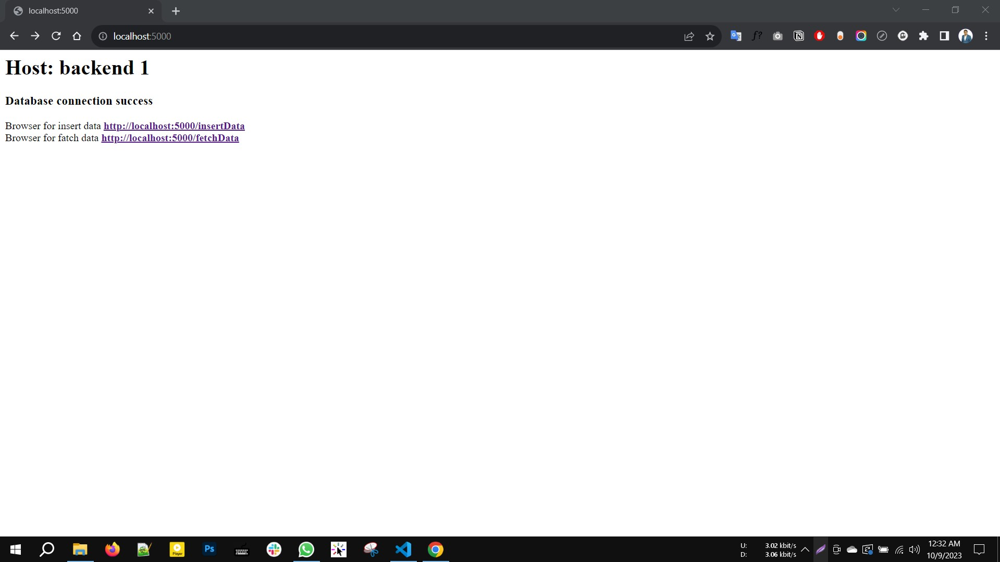
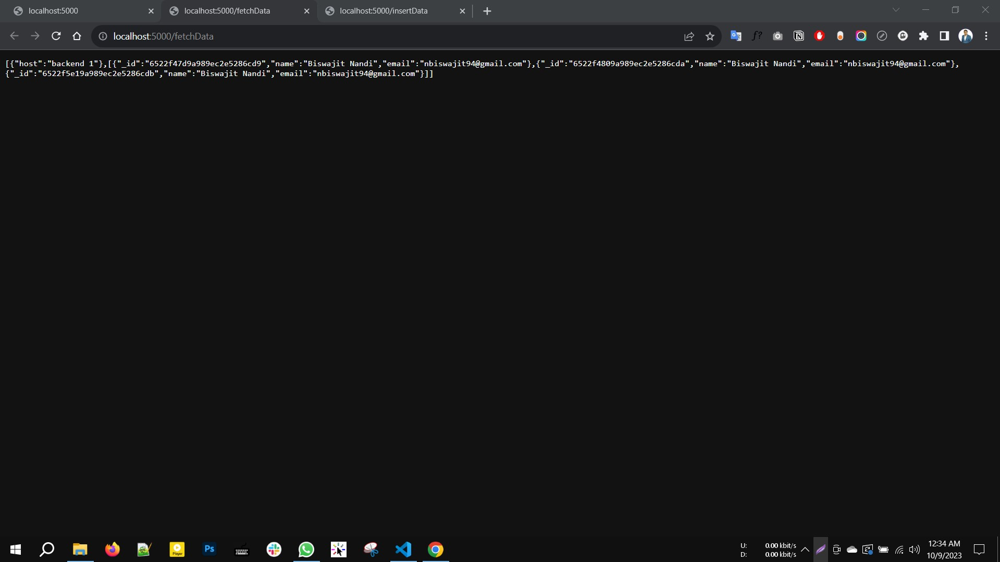

# nodejs-demo-app
This is a node demo application using the express js server and MongoDB database for checking database connection.



Insert data


Fetch data


Install packages
```
npm install
```
Start server
```
npm start
````
URL Browser

```
http://localhost:5000/
```

Browser for inserting data 
```
http://localhost:5000/insertData
```
Browser for fetching data 
```
http://localhost:5000/fetchData
```